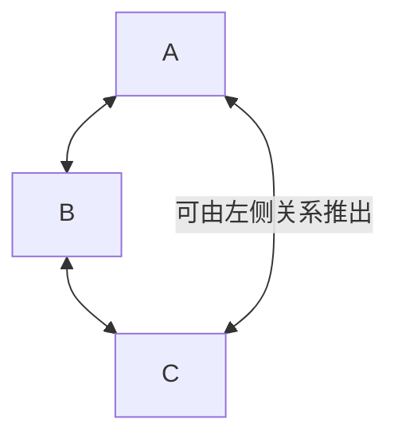

# 最短路算法

## Introduction

- [SPFA](#spfabellmanford--队列优化)
- [Dijkstra](#dijkstra)
- [Floyd](#floyd)


**图论最短路算法核心比较表**

| 特性                     | Dijkstra (优先队列优化)      | Bellman-Ford               | SPFA (队列优化BF)          | Floyd-Warshall             |
| :----------------------- | :--------------------------- | :------------------------- | :------------------------- | :------------------------- |
| **解决的问题类型**       | **单源最短路 (SSSP)**        | **单源最短路 (SSSP)**      | **单源最短路 (SSSP)**      | **全源最短路 (APSP)**      |
| **适用的图类型**         | **非负权** 有向图/无向图     | **任意权** 有向图/无向图   | **任意权** 有向图/无向图   | **任意权** 有向图/无向图   |
| **能否处理负权边？**     | ❌ 不能                      | ✅ 能                      | ✅ 能                      | ✅ 能                      |
| **能否检测负权环？**     | ❌ 不能                      | ✅ 能 (源点可达的环)       | ✅ 能 (源点可达的环)       | ✅ 能 (图中任意环)         |
| **时间复杂度**           | $ O( (V + E) \log V)$ | $ O(V \times E)$  | **最坏 $ O(V \times E) $** ，**平均 $ O(k E) $ (k为常数，通常很小)** | **$O(V^3)$**                  |
| **空间复杂度**           | $O(V) \text{或} O(V + E)$             | $O(V)$                       | $O(V)$                       | $O(V^2)$                 |
| **核心思想**             | 贪心 + BFS，优先队列管理待处理顶点 | 动态规划，$V-1$ 轮松弛所有边 | BF 优化，队列管理松弛成功的顶点 | 动态规划，三重循环逐步扩展中间点集 |
| **主要优点**             | 非负权图中效率最高           | 能处理负权，可检测负环，实现简单 | 平均性能远优于 BF，处理负权高效 | 解决 APSP，代码简洁，能处理负权及检测负环 |
| **主要缺点/限制**        | 无法处理负权边               | 时间复杂度高，效率较低     | 最坏时间复杂度与 BF 相同，稳定性不如  Dijkstra | 时间复杂度高，仅适用于小规模图 (V 较小) |

1. **SSSP vs APSP:**
   - **SSSP (Single-Source Shortest Path):** 求解从**一个固定起点**到图中所有其他顶点的最短路径。Dijkstra, Bellman-Ford, SPFA 属于此类。
   - **APSP (All-Pairs Shortest Path):** 求解图中**任意两个顶点之间**的最短路径。Floyd-Warshall 专门解决此问题。也可通过运行 V 次 SSSP 算法解决（如 V 次 Dijkstra 或 V 次 SPFA），但效率取决于图规模和算法选择。

2. **负权边 vs 负权环：**
   - **负权边：** 边权值为负数。Dijkstra **无法处理**，会出错。其他三种算法可以处理。
   - **负权环 (Negative-Weight Cycle):** 图中存在一个环，其总边权之和为负。
     - 在负权环**可达**的路径上，不存在有限的最短路径（可以无限绕环使总权值趋近负无穷）。
     - Bellman-Ford 和 SPFA 在求解 SSSP 时可以 **检测源点可达的负权环**。
     - Floyd-Warshall 在求解 APSP 时可以 **检测图中是否存在任意负权环**（检查 `dist[i][i] < 0`）。
     - 如果图有负权边但 **没有负权环**，则所有最短路径都是有限且良定义的，BF、SPFA、Floyd 能正确求解。

3. **效率与选择指南 (简化版):**
   - **SSSP + 所有边权 >= 0：** **优先队列优化 Dijkstra** (最快)。
   - **SSSP + 含负权边/需检测负环：**
     - **不确定是否有负环/需要检测：** **Bellman-Ford** 或 **SPFA** (SPFA 通常更快)。
     - **确定无负环：****SPFA** (平均性能好)。
   - **APSP (任意两点间)：**
     - **图规模小 (V 小)：** **Floyd-Warshall** (简单直接)。
     - **图规模大 + 所有边权 >= 0：** **运行 V 次 Dijkstra**。
     - **图规模大 + 含负权边但无负环：** **运行 V 次 SPFA** (需注意最坏时间复杂度风险)。
     - **图规模大 + 含负权边且需检测负环：** 考虑 **Johnson's Algorithm** (结合 BF 和 Dijkstra) 或谨慎使用 Floyd (仅当 V 足够小)。

## Floyd

Floyd 算法基于传递闭包所设计。

> 所谓传递闭包：
> 传递闭包是集合 $X$ 上**二元关系** $R$ 的**最小传递关系**，其定义为包含R的所有传递关系的交集。例如在家族关系中，传递闭包可表达祖先关系，在航空线路中表示经多次航行可达的路径。**该概念在数学中具有严格的构造性定义，可通过有限元素序列实现路径连接。**
>
>任何关系R的传递闭包必定存在，通过包含R的传递关系交集构造。当两个传递关系取并集时，需通过**传递闭包保持传递性**，这在等价关系合并时尤为重要。该概念在图论中体现为**有向无环图的可达性关系**，并与计算复杂性理论中的NL类问题相关联。
> 
> ——摘自[百度百科](https://baike.baidu.com/item/%E4%BC%A0%E9%80%92%E9%97%AD%E5%8C%85)

我们只用知道它定义一种传递关系即可。这里的传递关系通常指**有向无权图中的可达性关系**。

所谓传递即满足如下图所示的关系：



[传递闭包的**例题**](https://www.luogu.com.cn/problem/B3611)可以帮助你更好的理解它的实际意义。

既然我们已经可以判定两点之间是否可达，我们尝试更近一步推出两点之间的最短路。


### 核心思想

Floyd-Warshall 是解决**全源最短路径 (APSP)** 问题的经典算法。

基于**动态规划**思想，通过逐步扩展中间点集来更新最短路径。

所谓**松弛**：给定三个顶点 $i, j, k$，总有 $dis_{i,j} = \min(dis_{i,j}, dis_{i,k} + dis_{k,j})$。正确性显然。

初始时，直接连接的两点距离为边权，不连接的点对距离为 $+\infty$，对角线元素为 $0$。

```cpp
#include<bits/stdc++.h>
#define int long long
using namespace std;
int n,m;
namespace Graph {
    const int maxn = 5e2+5;
    const int INF = 1e18;
    int dis[maxn][maxn];
    int u,v,w;
    void add() {
        cin>>u>>v>>w;
        dis[u][v] = min(dis[u][v], (int)w);
        return;
    }
    void Floyd(int n) {
        // k 为中间点：依次考虑经过点 1, 2, ..., n 的路径
        for(int k=1; k<=n; k++) {
            // i 为起点，j 为终点
            for(int i=1; i<=n; i++) {
                for(int j=1; j<=n; j++) {
                    if(dis[i][k] != INF && dis[k][j] != INF)
                        dis[i][j] = min(dis[i][j], dis[i][k] + dis[k][j]);
                }
            }
        }
    }
    bool check_neg_cycle(int n) {
        for(int i=1; i<=n; i++)
            if(dis[i][i] < 0)return true;
        return false;
    }
    void print(int n){
        if(check_neg_cycle(n)){
            cout<<-1<<endl;
            return;
        }
        for(int i=1;i<=n;i++){
            for(int j=1;j<=n;j++)
                cout<<dis[i][j]<<' ';
            cout<<endl;
        }
        return;
    }
}
signed main() {
    cin.tie(0)->sync_with_stdio(0);
    cin>>n>>m;
    for(int i=1;i<=n;i++)
        for(int j=1;j<=n;j++)
            Graph::dis[i][j] = (i==j)?0:Graph::INF;
    while(m--)Graph::add();
    Graph::Floyd(n);
    Graph::print(n);
    return 0;
}
```

**算法核心：三重循环**

- **第一层循环** $k=1$ 到 $n$：考虑经过中间点 $k$ 的路径。
- **第二层循环** $i=1$ 到 $n$：枚举起点。
- **第三层循环** $j=1$ 到 $n$：枚举终点。

**负权环检测**

在 Floyd 算法完成后，若存在 $dis[i][i] < 0$，则图中存在负权环（经过点 $i$ 的环权之和为负）。

收下模板[P1119](https://www.luogu.com.cn/problem/P1119)


## SPFA（BellmanFord + 队列优化）

### 前置算法 —— BellmanFord

基于**松弛**操作检测负环并实现最短路。

每轮**松弛**都要遍历所有边。

所谓**松弛**：给定一条边 $(u,v,w)$，总有 $dis_v = min(dis_v,dis_u + w)$。正确性显然。

初始时源点 $dis_{root}$ 为 $0$，其它点 $dis_i = inf$。

```cpp
#include<bits/stdc++.h>
#define int long long
using namespace std;
int n,m,s;
namespace Graph {
	struct Edge {
		int v,w;
	};
	constexpr int maxn = 1e4+5;
	int dis[maxn],u,v,w;
	vector<Edge> g[maxn];
	bool NC;//hasNegativeCycle
	void add() {
		cin>>u>>v>>w;
		g[u].push_back({v,w});
		return;
	}
	void BF(int n,int x) {
		for(int i=1; i<=n; i++)dis[i] = INT_MAX;
		dis[s] = 0;
		for(int i=0; i<n-1; i++) { //若存在最短路（无可达负环），最短路最多包括n-1条边
			for(int j=1; j<=n; j++) { //遍历所有边
				if(dis[j] == INT_MAX)continue;//inf + const = inf
				for(Edge e:g[j])
					dis[e.v] = min(dis[e.v],dis[j] + e.w);
			}
		}
		//再遍历一次，检测是否有可达负环
		for(int j=1; j<=n; j++) { //遍历所有边
			if(dis[j] == INT_MAX)continue;//inf + const = inf
			for(Edge e:g[j]){
				if(dis[e.v]>dis[j] + e.w){
					NC = true;
					return;
				}
			}
		}
		return;
	}
	void print(int n){
		if(NC){
			cout<<-1<<endl;
			return;
		}
		for(int i=1;i<=n;i++)cout<<dis[i]<<' ';
		cout<<endl;
		return;
	}

}
signed main() {
	cin>>n>>m>>s;
	while(m--)Graph::add();
	Graph::BF(n,s);
	Graph::print(n);
	return 0;
}
```

### SPFA

**前言**

SPFA（Shortest Path Faster Algorithem），是基于 BellmanFord 的队列优化算法，但是……

> 关于 SPFA
> 
> 它死了……

**不要在能使用 Dijkstra 的时候使用 SPFA 或 BellmanFord。**


---

> 很多时候我们并不需要那么多无用的松弛操作。
> 
> 很显然，只有上一次被松弛的结点，所连接的边，才有可能引起下一次的松弛操作。

由于只有上一次对 $dis_i$ 产生更新的点才会对下一次更新产生贡献，于是想到利用类似 BFS 的方法（使用队列）对 BellmanFord 进行优化。

```cpp 
namespace Graph{
    int nc,dis[maxn],cnt[maxn],u,v,w;
    struct Edge{
        int v,w;
    };
    bool inq[maxn];
    void spfa(int s){
        cin>>n>>m;
        vector<Edge>g[maxn];
        while(m--){
            cin>>u>>v>>w;
            g[u].push_back({v,w});
            if(w >= 0)g[v].push_back({u,w});
        }
        nc = false;
        memset(inq,0,sizeof(inq));
        memset(cnt,0,sizeof(cnt));
        memset(dis,0x3f,sizeof(dis));
        queue<int> q;
        dis[s] = 0;
        q.push(s);
        inq[s] = true;
        while(!q.empty()){
            u = q.front();
            q.pop();inq[u] = false;
            for(Edge p:g[u]){
                v = p.v,w = p.w;
                if(dis[v] > dis[u] + w){
                    dis[v] = dis[u] + w;
                    cnt[v] = cnt[u] + 1;
                    if(cnt[v] >= n){
                        nc = true;
                        break;
                    }
                    if(!inq[v]){
                        q.push(v);
                        inq[v] = true;
                    }
                }
            }

        }
        if(nc)cout<<"YES\n";
        else cout<<"NO\n";
    }
}
```

这样我们就可以轻松愉快的收下[这道模板题](https://www.luogu.com.cn/problem/P3371)的 **弱化版**


## Dijkstra

将结点分成两个集合：已确定最短路长度的点集（记为 S 集合）的和未确定最短路长度的点集（记为 T 集合）。一开始所有的点都属于 T 集合。

初始化 $dis_s = 0$，其他点的 $dis$ 均为 $+ \infty$。

然后重复这些操作：

1. 从 T 集合中，选取一个最短路长度最小的结点，移到 S 集合中（最短的边松弛出最短路的潜力最大）。
2. 对那些刚刚被加入 S 集合的结点的所有出边执行松弛操作。
3. 直到 T 集合为空，算法结束。

Dijkstra 遵循一条性质：最短路最小的边被最先加入集合 T 这也意味着 **Dijkstra无法处理负权边**

### 暴力做法

**时间复杂度 $O(V^2)$**

```cpp
namespace Graph {
    struct Edge {
        int v,w;
    };
    constexpr int maxn = 1e4+5;
    int dis[maxn],u,v,w,mind,cnt[maxn];
    vector<Edge> g[maxn];
    bool vis[maxn];
    void add() {
        cin>>u>>v>>w;
        g[u].push_back({v,w});
        return;
    }
    void Dijkstra(int n,int s){
        memset(dis,0x3f,sizeof(dis));
        dis[s] = 0;
        for(int i=1;i<=n;i++){
            // 1. 找到未访问顶点中距离最小的顶点
            mind = INT_MAX,u = -1;
            for(int j=1;j<=n;j++){
                if(!vis[j] && dis[j]<mind){
                    mind = dis[j];
                    u = j;
                }
            } 
            // 如果找不到可达的未访问顶点，结束循环
            if(u == -1)break;
            // 标记该顶点已访问
            vis[u] = true;
            // 2. 松弛操作：更新所有邻接顶点的距离
            for(Edge e:g[u]){
                v = e.v,w = e.w;
                if(!vis[i]){//只考虑未访问的节点 
                    dis[v] = min(dis[v],dis[u]+w);
                }
            }
        }
    }
    void print(int n){
        for(int i=1;i<=n;i++)cout<<dis[i]<<' ';
        cout<<endl;
        return;
    }
}
```

### 优先队列优化

**时间复杂度 $O((V+E) \log V)$**

```cpp
#include<bits/stdc++.h>
#define int long long
using namespace std;
int n,m,s;
namespace Graph {
    struct Edge {
        int v,w;
    };
    struct PII{
        int dis,k;
        inline friend bool operator < (PII a,PII b){return a.dis>b.dis;} //注意不要把大于号写成小于号
    };
    constexpr int maxn = 1e5+5;
    int dis[maxn],u,v,w,mind,cnt[maxn];
    vector<Edge> g[maxn];
    priority_queue< PII > pq;
    bool vis[maxn];
    void add() {
        cin>>u>>v>>w;
        g[u].push_back({v,w});
        return;
    }
    void Dijkstra(int n,int s){
        for(int i=1;i<=n;i++)dis[i] = INT_MAX;
        dis[s] = 0;
        pq.push({0,s});
        while(!pq.empty()){
            u = pq.top().k;
            pq.pop();
            if(vis[u])continue;
            vis[u] = true;
            for(Edge e:g[u]){
                v = e.v,w = e.w;
                if(dis[v] > dis[u] + w){
                    dis[v] = dis[u] + w;
                    pq.push({dis[v],v});
                }
            }
        }
    }
    void print(int n){
        for(int i=1;i<=n;i++)cout<<dis[i]<<' ';
        return;
    }
    
}
signed main() {
    cin>>n>>m>>s;
    while(m--)Graph::add();
    Graph::Dijkstra(n,s);
    Graph::print(n);
    return 0;
}
```

收下模板[P4479](https://www.luogu.com.cn/problem/P4779)

## Johnson全源最短路

**时间复杂度 $O(V \times E \log E)$**

### 核心思想

Johnson 算法的精妙之处在于它**巧妙地结合了 Bellman-Ford 算法和 Dijkstra 算法**的优势：

1. **处理负权边：** 利用 Bellman-Ford 算法的能力检测负权环并处理负权边。
2. **高效求解 APSP：** 利用 Dijkstra 算法在非负权重图上的效率，避免了对所有节点对重复运行 Bellman-Ford ($O(V^2E)$) 或使用 Floyd-Warshall ($O(V^3)$) 在稀疏图上的相对低效。
3. **重赋权（Reweighting）：**算法的核心步骤是通过一个**精心设计的权重转换函数**，修改原图 $G$ 中所有边的权重，生成一个新图 $G'$。这个转换的关键在于：
   - **保持最短路径：** 图 $G$ 中的最短路径在图 $G'$ 中仍然是相同节点序列的最短路径（反之亦然）。
   - **消除负权重：**图 $G'$ 中所有边的权重都变为**非负值** ($w' \geq 0$)。

一旦图 $G'$ 的所有边权变为非负，我们就可以对图 $G'$ 中的**每一个节点**安全地运行 **Dijkstra 算法**（单源最短路径算法，时间复杂度 $O(E \log V)$）来求解所有节点对的最短路径。最后，再将 $G'$ 中得到的最短路径距离**转换回**原图 $G$ 的距离。

### 算法步骤详解

记 a，b 之间的最短距离为 $\delta(a,b)$。

1. **添加新节点：**
   - 创建一个新的节点 $s$，该节点**不属于**原图 $G (V, E)$。
   - 从 $s$ 向原图 $G$ 中的**每一个节点** $v \in V$ 添加一条**权重为 0** 的有向边。
   - 这样得到一个新的图 $G'' = (V'', E'')$，其中 $V'' = V \cup \{s\}$, $E'' = E \cup \{(s, v) \mid v \in V, \text{weight}=0\}$。

2. **运行 Bellman-Ford 算法：**
   - 以新添加的节点 $s$ 作为源点，在扩展图 $G''$ 上运行 **Bellman-Ford 算法**。
   - **目的 1：检测负权环。**
     - 如果 Bellman-Ford 算法检测到 $G''$ 中存在从 $s$ 可达的负权环，则意味着**原图 $G$ 中也存在负权环**（因为新加的边权重为 0，环必然在原图中）。
     - **算法终止：** 如果存在负权环，则无法定义最短路径（因为可以无限次绕环降低路径长度），算法报告错误并结束。
   - **目的 2：计算势函数 $h(v)$。**
     - 如果不存在负权环，Bellman-Ford 算法会成功计算出从源点 $s$ 到原图 $G$ 中每个节点 $v \in V$ 的最短路径距离。
     - 我们将这个距离记作 $h(v)$，即 $h(v) = \delta(s, v)$（在 $G''$ 中）。
     - **$h(v)$ 被称为节点 $v$ 的“势能” 或“高度”。**

3. **重赋权（计算新权重 $w'$）：**
   - 对于原图 $G$ 中的**每一条边** $(u, v) \in E$，计算其**新的权重** $w'(u, v)$：
     $$
     w'(u, v) = w(u, v) + h(u) - h(v)
     $$
   - 这个转换是 Johnson 算法的**核心魔法**：
     - **消除负权：** $w'(u, v) \geq 0$。证明如下：
       根据三角不等式（由 Bellman-Ford 保证的最短路径性质），在 $G''$ 中：
       $$
       \delta(s, v) \leq \delta(s, u) + w(u, v) \implies h(v) \leq h(u) + w(u, v)
       $$
       移项得：
       $$
       w(u, v) + h(u) - h(v) \geq 0 \implies w'(u, v) \geq 0
       $$
     - **保持最短路径：** 对于原图 $G$ 中的任意路径 $p = \langle v_0, v_1, \dots, v_k \rangle$，设 $w(p)$ 和 $w'(p)$ 分别表示该路径在 $G$ 和 $G'$ 中的权重。则有：
       $$
       w'(p) = w(p) + h(v_0) - h(v_k)
       $$
       证明：
       $$
       \begin{align*}
       w'(p) &= \sum_{i=1}^{k} w'(v_{i-1}, v_i) \\
             &= \sum_{i=1}^{k} \left[ w(v_{i-1}, v_i) + h(v_{i-1}) - h(v_i) \right] \\
             &= \left[ \sum_{i=1}^{k} w(v_{i-1}, v_i) \right] + \left[ h(v_0) - h(v_k) \right] \quad \text{(裂项相消)} \\
             &= w(p) + h(v_0) - h(v_k)
       \end{align*}
       $$
       - 这个等式表明：
         - 路径 $p$ 在 $G$ 和 $G'$ 中的权重**仅相差一个常数** $h(v_0) - h(v_k)$。
         - 这个常数**只与路径的起点 $v_0$ 和终点 $v_k$ 有关，与路径 $p$ 本身的具体节点序列无关**。
       - **结论：** 如果在原图 $G$ 中路径 $p$ 是从 $u$ 到 $v$ 的最短路径，那么在重赋权后的图 $G'$ 中，$p$ 也必然是从 $u$ 到 $v$ 的最短路径（因为所有从 $u$ 到 $v$ 的路径增加的权重都是相同的常数 $h(u) - h(v)$，所以权重最小的路径仍然是权重最小的路径）。反之亦然。

4. **在 $G'$ 上运行 Dijkstra：**
   - 现在，我们得到了一个新图 $G' = (V, E)$，其边权函数为 $w'$，且 $w'(u, v) \geq 0$。
   - 对于 $G'$ 中的**每一个节点** $u \in V$：
     - 以 $u$ 为源点，运行 **Dijkstra 算法**（因为所有边权非负）。
     - Dijkstra 算法会计算出从 $u$ 到 $G'$ 中所有其他节点 $v$ 的最短路径距离 $\delta'(u, v)$。

5. **还原原始距离：**
   - 对于每对节点 $(u, v)$，利用步骤 3 中推导出的关系 $w'(p) = w(p) + h(u) - h(v)$，将 $G'$ 中的最短路径距离 $\delta'(u, v)$ 还原为原图 $G$ 中的最短路径距离 $\delta(u, v)$：
     $$
     \delta(u, v) = \delta'(u, v) - h(u) + h(v)
     $$
     - 这个公式直接来自 $w'(p) = w(p) + h(u) - h(v)$ 的推广。因为 $\delta'(u, v)$ 是 $G'$ 中从 $u$ 到 $v$ 的最小 $w'$ 值，$\delta(u, v)$ 是 $G$ 中从 $u$ 到 $v$ 的最小 $w$ 值，它们之间的关系就是 $\delta'(u, v) = \delta(u, v) + h(u) - h(v)$。移项即得还原公式。


### Code
```cpp
#include<bits/stdc++.h>
#define int long long
using namespace std;
constexpr int maxn = 3e3 + 5, inf = 1e9;
int ans;
namespace G {
	struct Edge {
		int v, w;
	};
	struct PII{
		int dis,k;
		inline friend bool operator < (PII a,PII b){return a.dis>b.dis;}
	};
	vector<Edge>g[maxn];
	int n, m, u, v, w;
	void add_edge() {
		for (int i = 1; i <= m; i++) {
			cin >> u >> v >> w;
			g[u].push_back({v, w});
		}
		for (int i = 1; i <= n; i++) {
			g[0].push_back({i, w});
		}
	}
	int h[maxn], dis[maxn], cnt[maxn];
	bool inq[maxn], vis[maxn], nc = false;
	queue<int>q;
	priority_queue<PII>pq;
	void qin(int p) {
		q.push(p);
		inq[p] = true;
		cnt[p]++;
	}
	int qout() {
		int p = q.front();
		q.pop();
		inq[p] = false;
		return p;
	}
	void SPFA() {
		for (int i = 1; i <= n; i++)h[i] = inf;
		h[0] = 0;
		qin(0);
		while (!q.empty() && !nc) {
			u = qout();
			if (h[u] == inf)continue;
			for (auto [v, w] : g[u]) {
				if (h[v] > h[u] + w) { //find an update
					h[v] = h[u] + w;
					if (!inq[v]) {
						qin(v);
						if (cnt[v] > n)nc = true;
					}
				}
			}
		}
	}
	void remake() {
		for (int u = 1; u <= n; u++)
			for (auto& [v, w] : g[u])
				w += h[u] - h[v];
	}
	void Dijkstra(int s) {
		for (int i = 1; i <= n; i++)dis[i] = inf,vis[i] = false;
		pq.push({dis[s] = 0,s});
		while(!pq.empty()){
			u = pq.top().k;pq.pop();
			if(vis[u])continue;
			vis[u] = true;
			for(auto [v,w]:g[u]){
				if(dis[v] > dis[u] + w)pq.push({dis[v] = dis[u] + w,v});
			}
		}
	}
	void undo(int u){
		for(int v=1;v<=n;v++)if(dis[v] != inf)dis[v] -= h[u] - h[v];//记得特判dis = inf的情况
	}
}
using namespace G;
signed main() {
	ios::sync_with_stdio(0), cin.tie(0), cout.tie(0);
	cin >> n >> m;
	add_edge();
	SPFA();
	if (nc) {
		cout << -1;
		return 0;
	}
	remake();
	for(int i=1;i<=n;i++){
		ans = 0;
		Dijkstra(i);
		undo(i);
		for(int j=1;j<=n;j++)ans+=1LL * j * dis[j];
		cout<<ans<<endl;
	}
	return 0;
}
```

无伤通过[模版题](https://www.luogu.com.cn/problem/P5905)

## 最短路trick之分层图

一般的，我们使用 $dis$ 数组来记录每个节点的最短路。

我们可以借助动态规划的思想，来使用 $dis$ 数组记录下不同状态下到达某个节点的最短路。

每个状态对应一个**层**，这种具有多种状态或是动态变化的图我们称为分层图。

凭借这种思想可以通过许多与最短路有关的变种题目。

同样的，升维是一种很常用的 **Trick**。

```cpp
//case 1
if(k_u > 0){
	k_v = f1(k_u);
	if(dis[v][k_v] > /*A*/){
		dis[v][k_v] = /*A*/;
		pq.push({dis[v][k_v],v,k_v});
	}
}
//case 2
k_v = f2(k_u);
if(dis[v][k_v] > /*B*/){
	dis[v][k_v] = /*B*/;
	pq.push({dis[v][k_v],v,k_v});
}
```

用它替换掉 `Dijkstra` 里面的松弛操作即可（依照题意修改 `f1` `f2` `A` `B` 的内容即可）